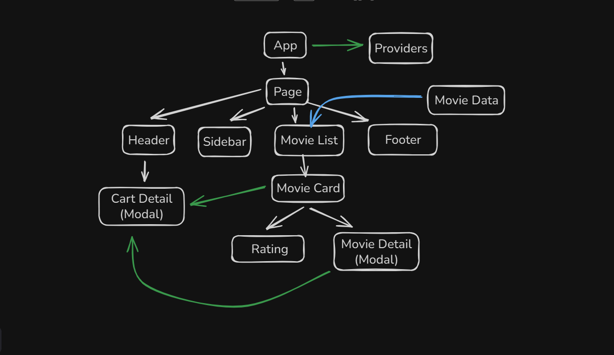
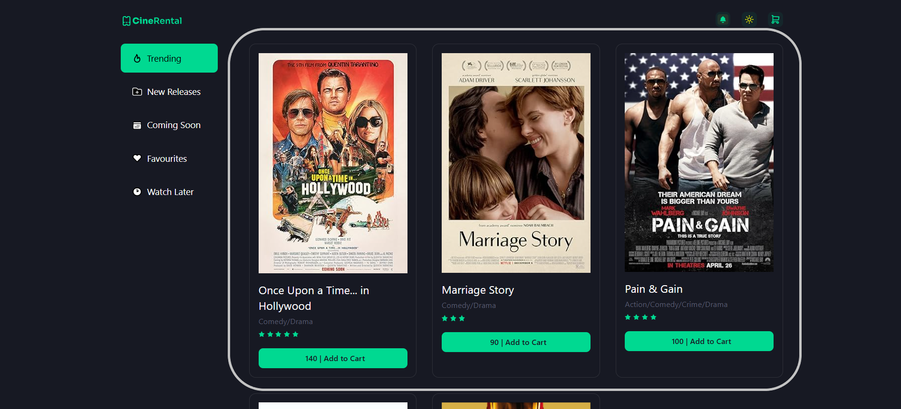
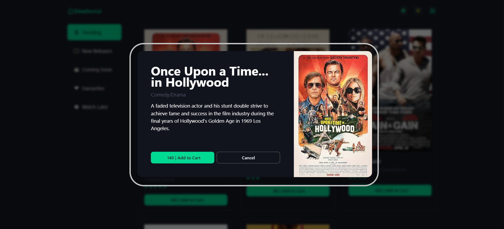
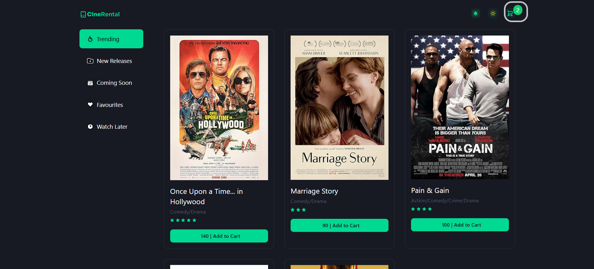
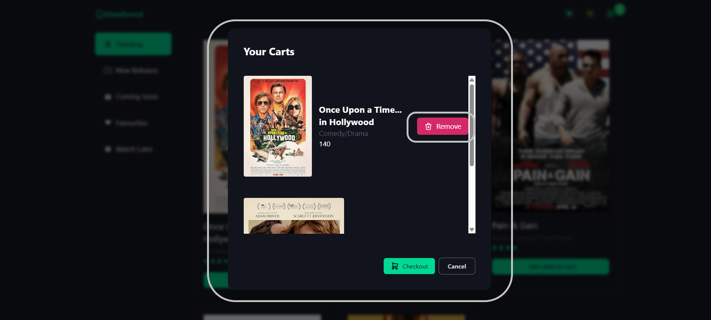
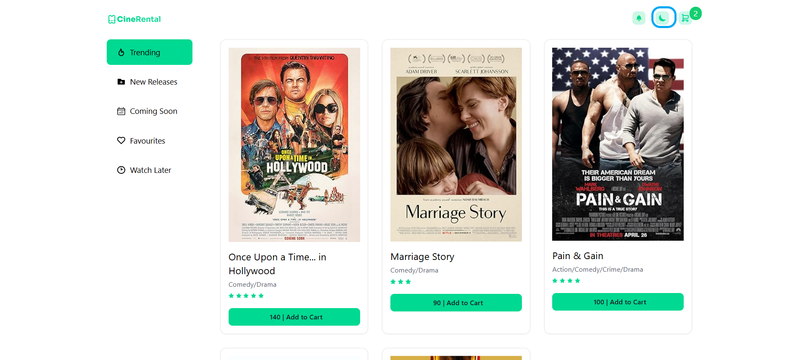

# CineRental – React Movie Rental UI

This project is a movie-rental interface built entirely with **React**, using **Context API** and **local component state** for global data sharing.
It includes a trending movies section, movie detail modal, theme switching (dark/light), and a fully functional cart system managed without any backend API.

This project aims to demonstrate UI logic, component architecture, modal handling, global state management, and cart interactions built from scratch.

</br>

## Component Architecture



## Live Demo

https://cine-rental-opal.vercel.app/

</br>

## Table of Contents

1. [Overview](#overview)

2. [Features](#features)

   - [Trending Movies](#1-trending-movies)
   - [Movie Details Modal](#2-movie-details-modal)
   - [Add to Cart](#3-add-to-cart)
   - [Cart Modal](#4-cart-modal)
   - [Dark / Light Mode](#5-dark--light-mode)
   - _(Placeholder) New Releases_
   - _(Placeholder) Coming Soon_
   - _(Placeholder) Favourites_
   - _(Placeholder) Watch Later_
   - _(Placeholder) Search_
   - _(Placeholder) Category Filters_

3. [Tech Stack](#tech-stack)

4. [Installation](#installation)

</br>

## Overview

CineRental currently focuses on the **Trending** movie section.
Users can browse trending movies, open a modal for more details, toggle between dark and light themes, and manage their rental cart entirely through **React state** and **Context API**.

No backend or external API is used at this stage — all movie data and cart interactions are handled in the front-end.

</br>

# Features

</br>

### 1. Trending Movies

- The homepage displays a list of trending movies.
- Each movie card shows:

  - Poster
  - Title
  - Genres
  - Rating
  - Rent Price

</br>

### Screenshot



</br>

### 2. Movie Details Modal

- When clicking a movie card, a modal opens showing:

  - Large poster
  - Title & genre
  - Rating
  - Description (if available)
  - Add to Cart button

- Clicking Add to Cart inside the modal also updates the global cart state.

</br>

### Screenshot



</br>

### 3. Add to Cart

- Movies can be added to the cart from:

  - The movie card
  - The movie detail modal

- Once added:

  - Cart count (top right corner) increases
  - The same movie cannot be duplicated

- Cart updates are handled using **Context API**.

</br>

### Screenshot



</br>

### 4. Cart Modal

- Clicking the cart icon opens a modal displaying:

  - All items currently in the cart
  - Movie image, name, price
  - Remove button for each item

- If the cart is empty:

  - A centered “No items in cart” message is displayed

Everything updates in real time using global state.

</br>

### Screenshot



</br>

### 5. Dark / Light Mode

- A theme toggle button is available in the navbar.
- Switching theme instantly updates UI colors.
- Theme state persists during usage.

</br>

### Screenshot



</br>

## ✨ Future Feature

_(You can expand these later when implemented.)_

### New Releases

_Coming soon…_

### Coming Soon Movies

_Coming soon…_

### Favourites

_Coming soon…_

### Watch Later

_Coming soon…_

### Search Functionality

_Coming soon…_

### Category Filters

_Coming soon…_

## Tech Stack

- React
- JavaScript
- Tailwind CSS

</br>

## Installation

```bash
# Clone repository
git clone https://github.com/aponroy0/CineRental.git

# Navigate
cd CineRental

# Install dependencies
npm install

# Start development server
npm run dev
```
